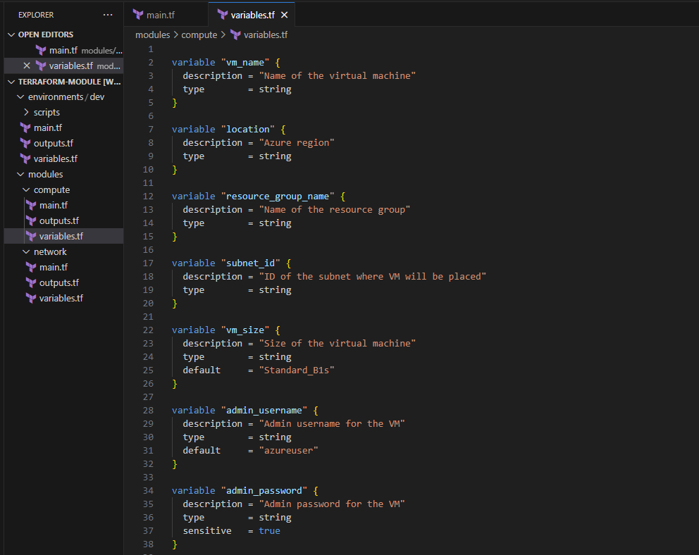
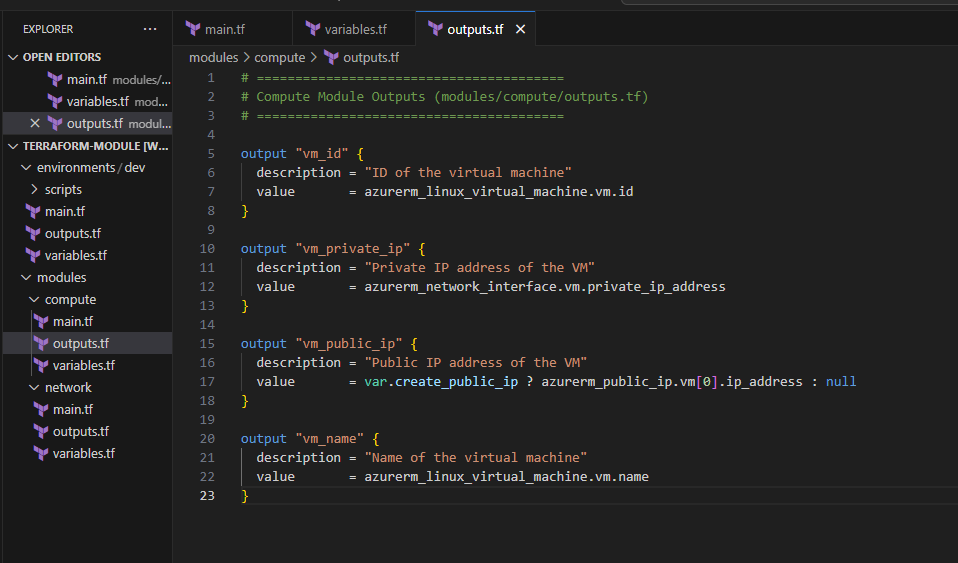
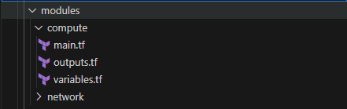
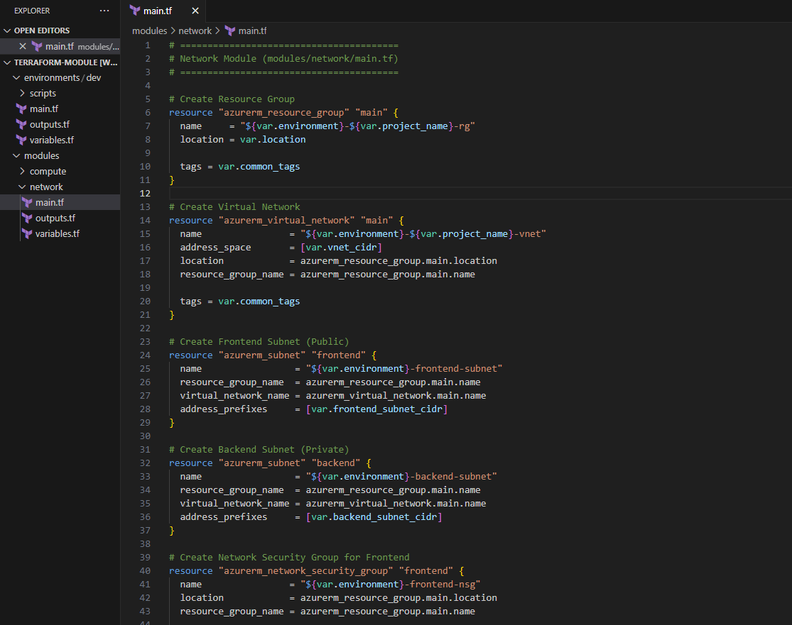
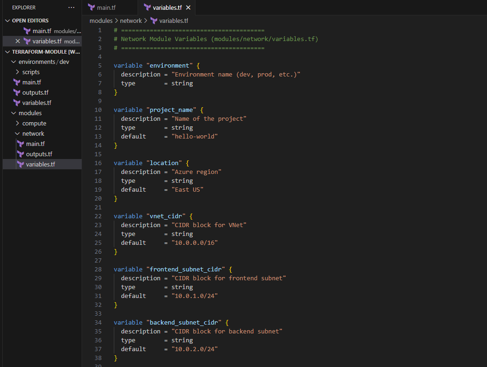
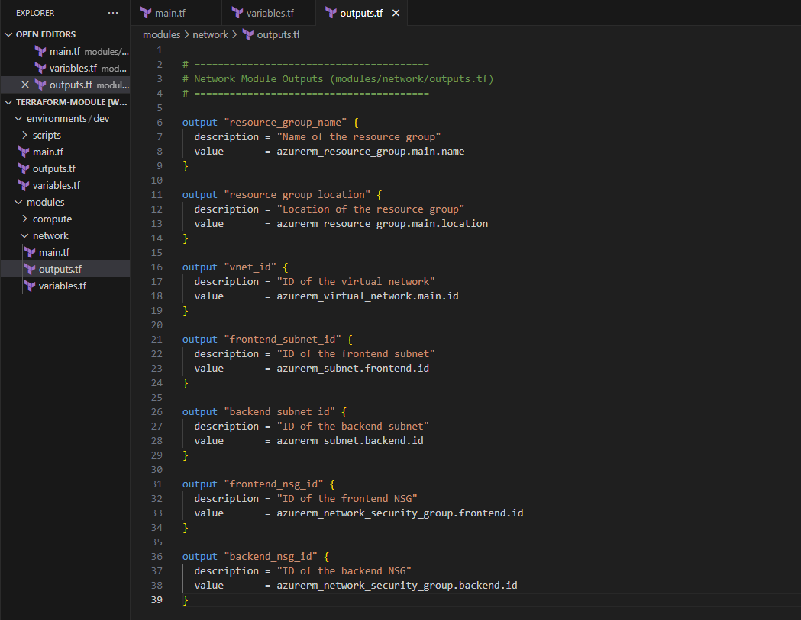
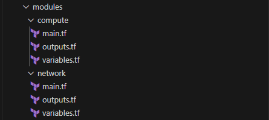

Terraform modules act like functions in programming, encapsulating reusable blocks of infrastructure code to promote organization, reusability, and standardization. They allow you to define a set of related resources, such as a VPC with its subnets and security groups, as a single unit, preventing repetitive code and simplifying complex deployments. By abstracting away underlying details and exposing only necessary input variables, modules facilitate consistency across environments and projects. This modular approach also enhances collaboration among teams, as specific modules can be developed and maintained independently, and their version control ensures easy tracking of changes and rollbacks.

Imagine you're building a simple "Hello World" app with two parts: a frontend VM to greet users and a backend VM that the frontend talks to. Instead of setting up each part manually for every environment, we'll use our LEGO bricks (Terraform modules)! 

You'd have:

1. A network module to lay down your foundational network stuff like VNets and subnets.
2. A compute module that knows how to fire up a VM, letting you customize its size and even tell it what little "Hello World" script to run when it starts.

Now, for your dev environments, you simply call these modules, tweaking things like VM sizes or network rules as needed. It's a super friendly way to see how modules keep your infrastructure neat, repeatable, and easy to manage, even for multi-tier applications! 

###  Instructions


1. In the terminal run the following command to create a new directory structure for your Terraform Azure VM project:

    ```bash
    #  Directory and file setup
    mkdir terraform-module
    cd terraform-module
    mkdir -p modules/compute modules/network environments/dev/scripts 

    touch \
    modules/compute/main.tf \
    modules/compute/outputs.tf \
    modules/compute/variables.tf \
    modules/network/main.tf \
    modules/network/outputs.tf \
    modules/network/variables.tf \
    environments/dev/main.tf \
    environments/dev/outputs.tf \
    environments/dev/variables.tf 

    touch \
    environments/dev/scripts/backend-startup.sh \
    environments/dev/scripts/frontend-startup.sh 
    ```

    


    File hierarchy will be look like this once you completed the above step:


    

2. Open `main.tf` file and add the following code (terraform-module/  modules/compute/main.tf):
    ```bash
    # ========================================
    #  Compute Module (modules/compute/main.tf)
    # ========================================

    # Create Public IP for Frontend VM
    resource "azurerm_public_ip" "vm" {
      count               = var.create_public_ip ? 1 : 0
      name                = "${var.vm_name}-pip"
      location            = var.location
      resource_group_name = var.resource_group_name
      allocation_method   = "Static"
      sku                 = "Standard"

      tags = var.common_tags
    }

    # 🔗 Create Network Interface
    resource "azurerm_network_interface" "vm" {
      name                = "${var.vm_name}-nic"
      location            = var.location
      resource_group_name = var.resource_group_name

      ip_configuration {
        name                          = "internal"
        subnet_id                     = var.subnet_id
        private_ip_address_allocation = "Dynamic"
        public_ip_address_id          = var.create_public_ip ? azurerm_public_ip.vm[0].id : null
      }

      tags = var.common_tags
    }

    #  Create Virtual Machine
    resource "azurerm_linux_virtual_machine" "vm" {
      name                = var.vm_name
      location            = var.location
      resource_group_name = var.resource_group_name
      size                = var.vm_size
      admin_username      = var.admin_username
      admin_password      = var.admin_password

      disable_password_authentication = false

      network_interface_ids = [
        azurerm_network_interface.vm.id,
      ] 
      
      os_disk {
        caching              = "ReadWrite"
        storage_account_type = var.disk_type
      }

      source_image_reference {
        publisher = "Canonical"
        offer     = "0001-com-ubuntu-server-jammy"
        sku       = "22_04-lts-gen2"
        version   = "latest"
      }

      custom_data = base64encode(var.startup_script)

      tags = var.common_tags
    }
    ```

    

    In this Terraform Configuration file contains the required LEGO frame to build VMs for the Hello-World Multi-tier web application.

3. Open the `variables.tf`  Configuration file and add the following code (modules/compute/variables.tf):
    ``` bash

    variable "vm_name" {
    description = "Name of the virtual machine"
    type        = string
    }

    variable "location" {
    description = "Azure region"
    type        = string
    }

    variable "resource_group_name" {
    description = "Name of the resource group"
    type        = string
    }

    variable "subnet_id" {
    description = "ID of the subnet where VM will be placed"
    type        = string
    }

    variable "vm_size" {
    description = "Size of the virtual machine"
    type        = string
    default     = "Standard_B1s"
    }

    variable "admin_username" {
    description = "Admin username for the VM"
    type        = string
    default     = "azureuser"
    }

    variable "admin_password" {
    description = "Admin password for the VM"
    type        = string
    sensitive   = true
    }

    variable "startup_script" {
    description = "Startup script to run on VM creation"
    type        = string
    default     = ""
    }

    variable "create_public_ip" {
    description = "Whether to create a public IP for the VM"
    type        = bool
    default     = false
    }

    variable "disk_type" {
    description = "Type of managed disk"
    type        = string
    default     = "Premium_LRS"
    }

    variable "common_tags" {
    description = "Common tags for all resources"
    type        = map(string)
    default     = {}
    }

    ```
    

    This file is used to declare input variables for your Terraform configuration. It defines the names, types, default values (optional), and descriptions of the parameters you want to be able to customize when you run your Terraform code.

4. Open the `outputs.tf ` Configuration file and add the following code (modules/compute/outputs.tf):
    ``` bash

    # ========================================
    # Compute Module Outputs (modules/compute/outputs.tf)
    # ========================================

    output "vm_id" {
    description = "ID of the virtual machine"
    value       = azurerm_linux_virtual_machine.vm.id
    }

    output "vm_private_ip" {
    description = "Private IP address of the VM"
    value       = azurerm_network_interface.vm.private_ip_address
    }

    output "vm_public_ip" {
    description = "Public IP address of the VM"
    value       = var.create_public_ip ? azurerm_public_ip.vm[0].ip_address : null
    }

    output "vm_name" {
    description = "Name of the virtual machine"
    value       = azurerm_linux_virtual_machine.vm.name
    }

    ```
    
    ---

    Once you complete all the 3 steps your current working directory should look like this.

    

Now we have the LEGO block to create all required Compute resources in Dev environments.

---

5. Open `main.tf` configuration file under (modules/network) and add the following code:

    ```bash
    # ========================================
    # Network Module (modules/network/main.tf)
    # ========================================

    # Create Resource Group
    resource "azurerm_resource_group" "main" {
    name     = "${var.environment}-${var.project_name}-rg"
    location = var.location

    tags = var.common_tags
    }

    # Create Virtual Network
    resource "azurerm_virtual_network" "main" {
    name                = "${var.environment}-${var.project_name}-vnet"
    address_space       = [var.vnet_cidr]
    location            = azurerm_resource_group.main.location
    resource_group_name = azurerm_resource_group.main.name

    tags = var.common_tags
    }

    # Create Frontend Subnet (Public)
    resource "azurerm_subnet" "frontend" {
    name                 = "${var.environment}-frontend-subnet"
    resource_group_name  = azurerm_resource_group.main.name
    virtual_network_name = azurerm_virtual_network.main.name
    address_prefixes     = [var.frontend_subnet_cidr]
    }

    # Create Backend Subnet (Private)
    resource "azurerm_subnet" "backend" {
    name                 = "${var.environment}-backend-subnet"
    resource_group_name  = azurerm_resource_group.main.name
    virtual_network_name = azurerm_virtual_network.main.name
    address_prefixes     = [var.backend_subnet_cidr]
    }

    # Create Network Security Group for Frontend
    resource "azurerm_network_security_group" "frontend" {
    name                = "${var.environment}-frontend-nsg"
    location            = azurerm_resource_group.main.location
    resource_group_name = azurerm_resource_group.main.name

    security_rule {
        name                       = "HTTP"
        priority                   = 1001
        direction                  = "Inbound"
        access                     = "Allow"
        protocol                   = "Tcp"
        source_port_range          = "*"
        destination_port_range     = "80"
        source_address_prefix      = "*"
        destination_address_prefix = "*"
    }

    security_rule {
        name                       = "SSH"
        priority                   = 1002
        direction                  = "Inbound"
        access                     = "Allow"
        protocol                   = "Tcp"
        source_port_range          = "*"
        destination_port_range     = "22"
        source_address_prefix      = "*"
        destination_address_prefix = "*"
    }

    tags = var.common_tags
    }

    # Create Network Security Group for Backend
    resource "azurerm_network_security_group" "backend" {
    name                = "${var.environment}-backend-nsg"
    location            = azurerm_resource_group.main.location
    resource_group_name = azurerm_resource_group.main.name

    security_rule {
        name                       = "HTTP-Internal"
        priority                   = 1001
        direction                  = "Inbound"
        access                     = "Allow"
        protocol                   = "Tcp"
        source_port_range          = "*"
        destination_port_range     = "8080"
        source_address_prefix      = var.frontend_subnet_cidr
        destination_address_prefix = "*"
    }

    security_rule {
        name                       = "SSH-Internal"
        priority                   = 1002
        direction                  = "Inbound"
        access                     = "Allow"
        protocol                   = "Tcp"
        source_port_range          = "*"
        destination_port_range     = "22"
        source_address_prefix      = var.frontend_subnet_cidr
        destination_address_prefix = "*"
    }

    tags = var.common_tags
    }

    # Associate NSGs with subnets
    resource "azurerm_subnet_network_security_group_association" "frontend" {
    subnet_id                 = azurerm_subnet.frontend.id
    network_security_group_id = azurerm_network_security_group.frontend.id
    }

    resource "azurerm_subnet_network_security_group_association" "backend" {
    subnet_id                 = azurerm_subnet.backend.id
    network_security_group_id = azurerm_network_security_group.backend.id
    }

    ```
    

6.  Open `variables.tf` Terraform Configuration file under (modules/network/variables.tf) and add the following code:
    ```bash
    # ========================================
    # Network Module Variables (modules/network/variables.tf)
    # ========================================

    variable "environment" {
    description = "Environment name (dev, prod, etc.)"
    type        = string
    }

    variable "project_name" {
    description = "Name of the project"
    type        = string
    default     = "hello-world"
    }

    variable "location" {
    description = "Azure region"
    type        = string
    default     = "East US"
    }

    variable "vnet_cidr" {
    description = "CIDR block for VNet"
    type        = string
    default     = "10.0.0.0/16"
    }

    variable "frontend_subnet_cidr" {
    description = "CIDR block for frontend subnet"
    type        = string
    default     = "10.0.1.0/24"
    }

    variable "backend_subnet_cidr" {
    description = "CIDR block for backend subnet"
    type        = string
    default     = "10.0.2.0/24"
    }

    variable "common_tags" {
    description = "Common tags for all resources"
    type        = map(string)
    default     = {}
    }

    ```
    

7. Open  `outputs.tf` terraform Configuration file under (modules/network/outputs.tf) and add the following code:
    ```bash

    # ========================================
    # Network Module Outputs (modules/network/outputs.tf)
    # ========================================

    output "resource_group_name" {
    description = "Name of the resource group"
    value       = azurerm_resource_group.main.name
    }

    output "resource_group_location" {
    description = "Location of the resource group"
    value       = azurerm_resource_group.main.location
    }

    output "vnet_id" {
    description = "ID of the virtual network"
    value       = azurerm_virtual_network.main.id
    }

    output "frontend_subnet_id" {
    description = "ID of the frontend subnet"
    value       = azurerm_subnet.frontend.id
    }

    output "backend_subnet_id" {
    description = "ID of the backend subnet"
    value       = azurerm_subnet.backend.id
    }

    output "frontend_nsg_id" {
    description = "ID of the frontend NSG"
    value       = azurerm_network_security_group.frontend.id
    }

    output "backend_nsg_id" {
    description = "ID of the backend NSG"
    value       = azurerm_network_security_group.backend.id
    }
    ```
    
    ---

Once you complete all the 3 steps your current working directory should look like this.



**Excellent! With our Network and Compute modules now defined, we have all the reusable "LEGO blocks" we need. This modular approach allows us to consistently build and manage our infrastructure.**

Let's now assemble these blocks to deploy our Development Environment for the "Hello World" multi-tier application.