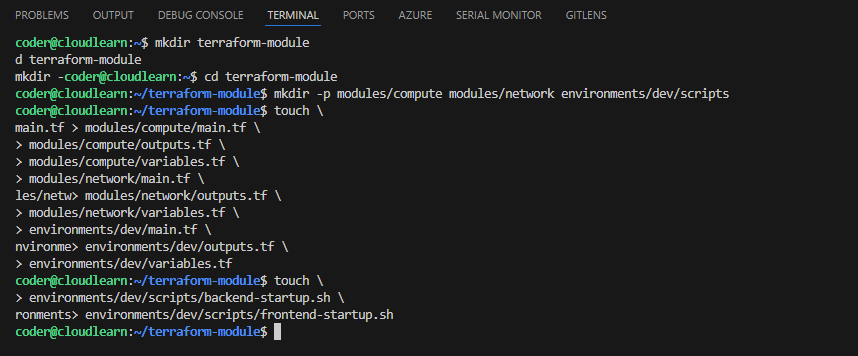
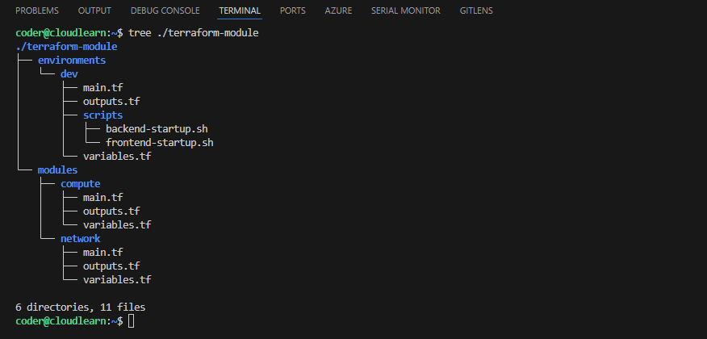

# 🏗️ Build a Modular Terraform Setup for Multi-tier Architecture #

Terraform modules act like functions in programming, encapsulating reusable blocks of infrastructure code to promote organization, reusability, and standardization. They allow you to define a set of related resources, such as a VPC with its subnets and security groups, as a single unit, preventing repetitive code and simplifying complex deployments. By abstracting away underlying details and exposing only necessary input variables, modules facilitate consistency across environments and projects. This modular approach also enhances collaboration among teams, as specific modules can be developed and maintained independently, and their version control ensures easy tracking of changes and rollbacks.

## 🌍 Your "Hello World" Multi-Tier Lab
Terraform modules are like your trusty LEGO bricks for infrastructure! 🧱 They let you package up bits of code, like a whole network setup or a ready-to-go virtual machine, into reusable units. 

Imagine you're building a simple "Hello World" app with two parts: a frontend VM to greet users and a backend VM that the frontend talks to. Instead of setting up each part manually for every environment, we'll use our LEGO bricks (Terraform modules)! 🚀

You'd have:

1. 📦 A network module to lay down your foundational network stuff like VNets and subnets.
2. 💻 A compute module that knows how to fire up a VM, letting you customize its size and even tell it what little "Hello World" script to run when it starts.

Now, for your dev environments, you simply call these modules, tweaking things like VM sizes or network rules as needed. It's a super friendly way to see how modules keep your infrastructure neat, repeatable, and easy to manage, even for multi-tier applications! ✅

## 1.📁 Project Structure Setup

### 1.1 🏗️ Create Project Directory Hierarchy.

In the terminal run the following command to create a new directory structure for your Terraform Azure VM project:

```bash
#  Directory and file setup
mkdir terraform-module
cd terraform-module
mkdir -p modules/compute modules/network environments/dev/scripts 

touch \
modules/compute/main.tf \
modules/compute/outputs.tf \
modules/compute/variables.tf \
modules/network/main.tf \
modules/network/outputs.tf \
modules/network/variables.tf \
environments/dev/main.tf \
environments/dev/outputs.tf \
environments/dev/variables.tf 

touch \
environments/dev/scripts/backend-startup.sh \
environments/dev/scripts/frontend-startup.sh 
```




File hierarchy will be look like this once you completed the above step:




