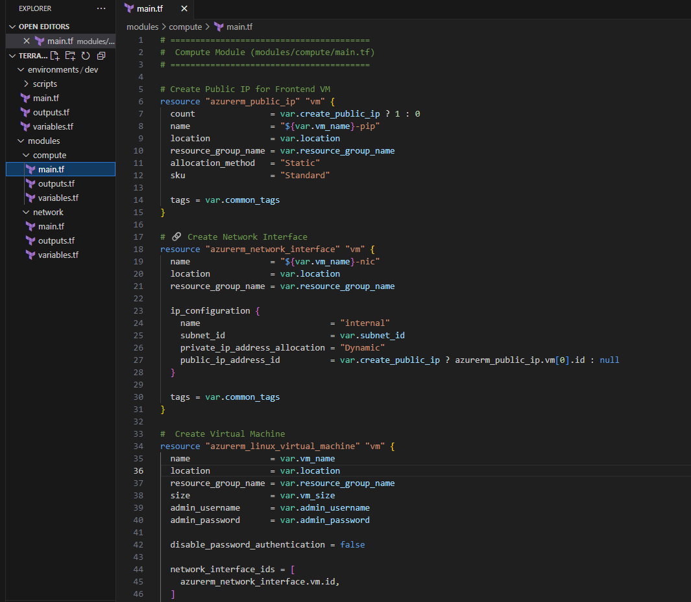
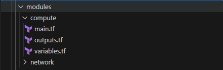

## 2. ⚙️ Terraform Files Creation
### 2.1 💻 Create the Compute Module

1. Open `main.tf` file and add the following code (terraform-module/modules/compute/main.tf):
```bash
# ========================================
#  Compute Module (modules/compute/main.tf)
# ========================================

# Create Public IP for Frontend VM
resource "azurerm_public_ip" "vm" {
  count               = var.create_public_ip ? 1 : 0
  name                = "${var.vm_name}-pip"
  location            = var.location
  resource_group_name = var.resource_group_name
  allocation_method   = "Static"
  sku                 = "Standard"

  tags = var.common_tags
}

# 🔗 Create Network Interface
resource "azurerm_network_interface" "vm" {
  name                = "${var.vm_name}-nic"
  location            = var.location
  resource_group_name = var.resource_group_name

  ip_configuration {
    name                          = "internal"
    subnet_id                     = var.subnet_id
    private_ip_address_allocation = "Dynamic"
    public_ip_address_id          = var.create_public_ip ? azurerm_public_ip.vm[0].id : null
  }

  tags = var.common_tags
}

#  Create Virtual Machine
resource "azurerm_linux_virtual_machine" "vm" {
  name                = var.vm_name
  location            = var.location
  resource_group_name = var.resource_group_name
  size                = var.vm_size
  admin_username      = var.admin_username
  admin_password      = var.admin_password

  disable_password_authentication = false

  network_interface_ids = [
    azurerm_network_interface.vm.id,
  ] 
  
  os_disk {
    caching              = "ReadWrite"
    storage_account_type = var.disk_type
  }

  source_image_reference {
    publisher = "Canonical"
    offer     = "0001-com-ubuntu-server-jammy"
    sku       = "22_04-lts-gen2"
    version   = "latest"
  }

  custom_data = base64encode(var.startup_script)

  tags = var.common_tags
}
```


In this Terraform Configuration file contains the required LEGO frame to build VMs for the Hello-World Multi-tier web application.

2. Open the `variables.tf`  Configuration file and add the following code (modules/compute/variables.tf):
``` bash

variable "vm_name" {
  description = "Name of the virtual machine"
  type        = string
}

variable "location" {
  description = "Azure region"
  type        = string
}

variable "resource_group_name" {
  description = "Name of the resource group"
  type        = string
}

variable "subnet_id" {
  description = "ID of the subnet where VM will be placed"
  type        = string
}

variable "vm_size" {
  description = "Size of the virtual machine"
  type        = string
  default     = "Standard_B1s"
}

variable "admin_username" {
  description = "Admin username for the VM"
  type        = string
  default     = "azureuser"
}

variable "admin_password" {
  description = "Admin password for the VM"
  type        = string
  sensitive   = true
}

variable "startup_script" {
  description = "Startup script to run on VM creation"
  type        = string
  default     = ""
}

variable "create_public_ip" {
  description = "Whether to create a public IP for the VM"
  type        = bool
  default     = false
}

variable "disk_type" {
  description = "Type of managed disk"
  type        = string
  default     = "Premium_LRS"
}

variable "common_tags" {
  description = "Common tags for all resources"
  type        = map(string)
  default     = {}
}

```


This file is used to declare input variables for your Terraform configuration. It defines the names, types, default values (optional), and descriptions of the parameters you want to be able to customize when you run your Terraform code.

1. Open the `outputs.tf ` Configuration file and add the following code (modules/compute/outputs.tf):
``` bash

# ========================================
# Compute Module Outputs (modules/compute/outputs.tf)
# ========================================

output "vm_id" {
  description = "ID of the virtual machine"
  value       = azurerm_linux_virtual_machine.vm.id
}

output "vm_private_ip" {
  description = "Private IP address of the VM"
  value       = azurerm_network_interface.vm.private_ip_address
}

output "vm_public_ip" {
  description = "Public IP address of the VM"
  value       = var.create_public_ip ? azurerm_public_ip.vm[0].ip_address : null
}

output "vm_name" {
  description = "Name of the virtual machine"
  value       = azurerm_linux_virtual_machine.vm.name
}

```

---

✅ Once you complete all the 3 steps your current working directory should look like this.



🎉 Now we have the LEGO block to create all required Compute resources in Dev and environments.