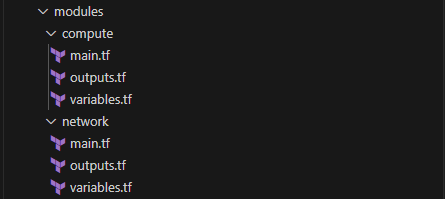

# 🌐 3.0 Create the Network Module
Navigate to the modules directory and go to the Network module files: 📁

```bash
cd ../network
touch modules/network/main.tf \
modules/network/outputs.tf \
modules/network/variables.tf \
```
### 3.1 📝 Module Main Configuration (modules/network/main.tf)

```terraform
# ========================================
# Network Module (modules/network/main.tf)
# ========================================

# Create Resource Group
resource "azurerm_resource_group" "main" {
  name     = "${var.environment}-${var.project_name}-rg"
  location = var.location

  tags = var.common_tags
}

# Create Virtual Network
resource "azurerm_virtual_network" "main" {
  name                = "${var.environment}-${var.project_name}-vnet"
  address_space       = [var.vnet_cidr]
  location            = azurerm_resource_group.main.location
  resource_group_name = azurerm_resource_group.main.name

  tags = var.common_tags
}

# Create Frontend Subnet (Public)
resource "azurerm_subnet" "frontend" {
  name                 = "${var.environment}-frontend-subnet"
  resource_group_name  = azurerm_resource_group.main.name
  virtual_network_name = azurerm_virtual_network.main.name
  address_prefixes     = [var.frontend_subnet_cidr]
}

# Create Backend Subnet (Private)
resource "azurerm_subnet" "backend" {
  name                 = "${var.environment}-backend-subnet"
  resource_group_name  = azurerm_resource_group.main.name
  virtual_network_name = azurerm_virtual_network.main.name
  address_prefixes     = [var.backend_subnet_cidr]
}

# Create Network Security Group for Frontend
resource "azurerm_network_security_group" "frontend" {
  name                = "${var.environment}-frontend-nsg"
  location            = azurerm_resource_group.main.location
  resource_group_name = azurerm_resource_group.main.name

  security_rule {
    name                       = "HTTP"
    priority                   = 1001
    direction                  = "Inbound"
    access                     = "Allow"
    protocol                   = "Tcp"
    source_port_range          = "*"
    destination_port_range     = "80"
    source_address_prefix      = "*"
    destination_address_prefix = "*"
  }

  security_rule {
    name                       = "SSH"
    priority                   = 1002
    direction                  = "Inbound"
    access                     = "Allow"
    protocol                   = "Tcp"
    source_port_range          = "*"
    destination_port_range     = "22"
    source_address_prefix      = "*"
    destination_address_prefix = "*"
  }

  tags = var.common_tags
}

# Create Network Security Group for Backend
resource "azurerm_network_security_group" "backend" {
  name                = "${var.environment}-backend-nsg"
  location            = azurerm_resource_group.main.location
  resource_group_name = azurerm_resource_group.main.name

  security_rule {
    name                       = "HTTP-Internal"
    priority                   = 1001
    direction                  = "Inbound"
    access                     = "Allow"
    protocol                   = "Tcp"
    source_port_range          = "*"
    destination_port_range     = "8080"
    source_address_prefix      = var.frontend_subnet_cidr
    destination_address_prefix = "*"
  }

  security_rule {
    name                       = "SSH-Internal"
    priority                   = 1002
    direction                  = "Inbound"
    access                     = "Allow"
    protocol                   = "Tcp"
    source_port_range          = "*"
    destination_port_range     = "22"
    source_address_prefix      = var.frontend_subnet_cidr
    destination_address_prefix = "*"
  }

  tags = var.common_tags
}

# Associate NSGs with subnets
resource "azurerm_subnet_network_security_group_association" "frontend" {
  subnet_id                 = azurerm_subnet.frontend.id
  network_security_group_id = azurerm_network_security_group.frontend.id
}

resource "azurerm_subnet_network_security_group_association" "backend" {
  subnet_id                 = azurerm_subnet.backend.id
  network_security_group_id = azurerm_network_security_group.backend.id
}

```

### 3.2 ⚙️ Module variables Configuration (modules/network/variables.tf)
```terraform
# ========================================
# Network Module Variables (modules/network/variables.tf)
# ========================================

variable "environment" {
  description = "Environment name (dev, prod, etc.)"
  type        = string
}

variable "project_name" {
  description = "Name of the project"
  type        = string
  default     = "hello-world"
}

variable "location" {
  description = "Azure region"
  type        = string
  default     = "East US"
}

variable "vnet_cidr" {
  description = "CIDR block for VNet"
  type        = string
  default     = "10.0.0.0/16"
}

variable "frontend_subnet_cidr" {
  description = "CIDR block for frontend subnet"
  type        = string
  default     = "10.0.1.0/24"
}

variable "backend_subnet_cidr" {
  description = "CIDR block for backend subnet"
  type        = string
  default     = "10.0.2.0/24"
}

variable "common_tags" {
  description = "Common tags for all resources"
  type        = map(string)
  default     = {}
}

```

### 3.3 📤 Module Outputs Configuration (modules/network/outputs.tf)
```terraform

# ========================================
# Network Module Outputs (modules/network/outputs.tf)
# ========================================

output "resource_group_name" {
  description = "Name of the resource group"
  value       = azurerm_resource_group.main.name
}

output "resource_group_location" {
  description = "Location of the resource group"
  value       = azurerm_resource_group.main.location
}

output "vnet_id" {
  description = "ID of the virtual network"
  value       = azurerm_virtual_network.main.id
}

output "frontend_subnet_id" {
  description = "ID of the frontend subnet"
  value       = azurerm_subnet.frontend.id
}

output "backend_subnet_id" {
  description = "ID of the backend subnet"
  value       = azurerm_subnet.backend.id
}

output "frontend_nsg_id" {
  description = "ID of the frontend NSG"
  value       = azurerm_network_security_group.frontend.id
}

output "backend_nsg_id" {
  description = "ID of the backend NSG"
  value       = azurerm_network_security_group.backend.id
}
```
---

✅ Once you complete all the 3 steps your current working directory should look like this.



🎉 **Excellent! With our Network and Compute modules now defined, we have all the reusable "LEGO blocks" we need. This modular approach allows us to consistently build and manage our infrastructure.**

Let's now assemble these blocks to deploy our Development Environment for the "Hello World" multi-tier application.