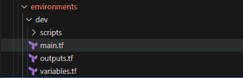

Now that we have our core Network and Compute modules (our robust "LEGO blocks" or "templates"), the process of deploying different environments becomes incredibly efficient.

Instead of rewriting infrastructure code for each environment, we simply need to:

1. 📝 Define the specific configurations and requirements for our Development (Dev) and Production (Prod) environments.
2. ⚙️ Feed these unique configurations as variables into our standardized Network and Compute modules.
---
🆚 **Planned Difference for the Prod and Dev Environment.**

| Feature / Configuration Aspect | Development Environment (Dev) | Production Environment (Prod) |
| :----------------------------- | :---------------------------- | :---------------------------- |
| **Environment Identifier** | `environment = "dev"`         | `environment = "prod"`        |
| **VM Admin Password Source** | Generated by `random_password` resource directly in `dev/main.tf` | Retrieved from Azure Key Vault using `data "azurerm_key_vault_secret"` |
| **Frontend VM Size** | `vm_size = "Standard_B1s"` (Smaller, cost-effective) | `vm_size = "Standard_B2s"` (Larger, more performance) |
| **Backend VM Size** | `vm_size = "Standard_B1s"` (Smaller, cost-effective) | `vm_size = "Standard_B2s"` (Larger, more performance) |
| **VM Disk Type** | Uses module default (`Premium_LRS`) - but it's the same default | Explicitly set to `disk_type = "Premium_LRS"` (Ensures high performance) |
| **VNet Name Convention** | `dev-hello-world-vnet`        | `prod-hello-world-vnet`       |
| **Resource Group Name** | `dev-hello-world-rg`          | `prod-hello-world-rg`         |

### 📝 4.1 Let's create Module main configuration with required configuration drift. (`/environments/dev/main.tf`)

```bash
cd $pwd/../../environments/dev
touch main.tf outputs.tf 
```

🖊️ Open the `main.tf` file in VSCode and add the following code content:
```terraform
# ========================================
# Development Environment (environments/dev/main.tf)
# ========================================

terraform {
  required_providers {
    azurerm = {
      source  = "hashicorp/azurerm"
      version = "~>3.0"
    }
  }
}

provider "azurerm" {
  features {}
}

# Generate random password for VMs
resource "random_password" "vm_password" {
  length  = 16
  special = true
  upper   = true
  lower   = true
  numeric = true
}

# Create network infrastructure
module "network" {
  source = "../../modules/network"

  environment = "dev"
  location    = "East US"
  
  common_tags = {
    Environment = "Development"
    Project     = "Hello World App"
    Owner       = "DevOps Team"
  }
}

# Frontend VM with Hello World web server
module "frontend_vm" {
  source = "../../modules/compute"

  vm_name             = "dev-frontend-vm"
  location            = module.network.resource_group_location
  resource_group_name = module.network.resource_group_name
  subnet_id           = module.network.frontend_subnet_id
  vm_size             = "Standard_B1s"  # Small size for dev
  admin_password      = random_password.vm_password.result
  create_public_ip    = true

  startup_script = templatefile("${path.module}/scripts/frontend-startup.sh", {
    backend_ip = module.backend_vm.vm_private_ip
  })

  common_tags = {
    Environment = "Development"
    Project     = "Hello World App"
    Tier        = "Frontend"
  }

  depends_on = [module.backend_vm]
}

# Backend VM with API service
module "backend_vm" {
  source = "../../modules/compute"

  vm_name             = "dev-backend-vm"
  location            = module.network.resource_group_location
  resource_group_name = module.network.resource_group_name
  subnet_id           = module.network.backend_subnet_id
  vm_size             = "Standard_B1s"  # Small size for dev
  admin_password      = random_password.vm_password.result
  create_public_ip    = false  # Backend is private

  startup_script = file("${path.module}/scripts/backend-startup.sh")
  # Assuming backend-startup.sh sets up the API service

  common_tags = {
    Environment = "Development"
    Project     = "Hello World App"
    Tier        = "Backend"
  }
}
```
### 📤 4.2 Module Outputs Configuration (`/environments/dev/outputs.tf`)
So we can view all the details after deploying the VMs.
```terraform
output "frontend_public_ip" {
  description = "Public IP of the frontend VM"
  value       = module.frontend_vm.vm_public_ip
}

output "frontend_private_ip" {
  description = "Private IP of the frontend VM"
  value       = module.frontend_vm.vm_private_ip
}

output "backend_private_ip" {
  description = "Private IP of the backend VM"
  value       = module.backend_vm.vm_private_ip
}

output "vm_admin_password" {
  description = "Admin password for VM access"
  value       = random_password.vm_password.result
  sensitive   = true
}

output "vm_admin_username" {
  description = "Admin username for VM access"
  value       = "azureuser"
}

output "application_url" {
  description = "URL to access the Hello World application"
  value       = "http://${module.frontend_vm.vm_public_ip}"
}

```
### 📝 4.3 Create the startup scripts for the lab.
Here we just pre-configured the VMs with simple HelloWorld Application. 

#### 🖥️ 4.3.1 frontend-startup.sh
```bash
# ========================================
# Startup Scripts
# ========================================

# Frontend Startup Script (environments/dev/scripts/frontend-startup.sh)

#!/bin/bash

# Update apt cache.
sudo apt-get update

# Install Nginx.
sudo apt-get install -y nginx

# Set the home page.
sudo cat > /var/www/html/index.nginx-debian.html << 'EOF'
<!DOCTYPE html>
<html>
<head>
    <title>Hello World - Dev-Frontend</title>
    <style>
        body { font-family: Arial, sans-serif; margin: 40px; }
        .container { max-width: 600px; margin: 0 auto; text-align: center; }
        button { padding: 10px 20px; font-size: 16px; margin: 10px; }
        #response { margin-top: 20px; padding: 20px; background: #f0f0f0; }
    </style>
</head>
<body>
    <div class="container">
        <h1> Hello World Dev-Frontend!</h1>
        <p>This is the frontend tier of our Hello World application.</p>
        <button onclick="callBackend()">Call Backend Service</button>
        <div id="response"></div>
    </div>

    <script>
        async function callBackend() {
            try {
                const response = await fetch('http://${backend_ip}:8080/hello');
                const text = await response.text();
                document.getElementById('response').innerHTML = 
                    '<h3>Backend Response:</h3><p>' + text + '</p>';
            } catch (error) {
                document.getElementById('response').innerHTML = 
                    '<h3>Error:</h3><p>Could not reach backend service</p>';
            }
        }

        // Auto-call backend on page load
        window.onload = callBackend;
    </script>
</body>
</html>
EOF

# Start nginx
sudo systemctl start nginx
sudo systemctl enable nginx

```
#### 🖥️ 4.3.2 backend-startup.sh
```bash
# Backend Startup Script (environments/dev/scripts/backend-startup.sh)
#!/bin/bash
apt-get update
apt-get install -y python3 python3-pip

# Create a simple Python backend service
cat > /home/azureuser/backend.py << 'EOF'
from http.server import HTTPServer, BaseHTTPRequestHandler
import json
from datetime import datetime

class HelloHandler(BaseHTTPRequestHandler):
    def do_GET(self):
        if self.path == '/hello':
            self.send_response(200)
            self.send_header('Content-type', 'text/plain')
            self.send_header('Access-Control-Allow-Origin', '*')
            self.end_headers()
            
            message = f" Hello from the Dev-Backend! Current time: {datetime.now().strftime('%Y-%m-%d %H:%M:%S')}"
            self.wfile.write(message.encode())
        else:
            self.send_response(404)
            self.end_headers()
            self.wfile.write(b'Not Found')

if __name__ == '__main__':
    server = HTTPServer(('0.0.0.0', 8080), HelloHandler)
    print("Backend server starting on port 8080...")
    server.serve_forever()
EOF

# Create systemd service for backend
cat > /etc/systemd/system/hello-backend.service << 'EOF'
[Unit]
Description=Hello World Backend Service
After=network.target

[Service]
Type=simple
User=azureuser
WorkingDirectory=/home/azureuser
ExecStart=/usr/bin/python3 /home/azureuser/backend.py
Restart=always

[Install]
WantedBy=multi-user.target
EOF

# Start the backend service
systemctl daemon-reload
systemctl start hello-backend
systemctl enable hello-backend
```
---
✅ Once you complete all the 3 steps your current working directory should look like this.



💡 If you take a close look at our `environments/dev/main.tf` file, you'll notice a powerful example of module reusability in action:
```terraform
# ...
module "frontend_vm" {
  source = "../../modules/compute"
  # ... specific frontend VM configuration ...
}

module "backend_vm" {
  source = "../../modules/compute"
  # ... specific backend VM configuration ...
}
# ...
```
**Here, our single `modules/compute` directory acts as a reusable template for creating a virtual machine. Even though we only defined the compute module once, we are instantiating it twice within the dev environment:**

1. 🔁 Once for the frontend VM (`module "frontend_vm"`).
2. 🔁 And again for the backend VM (`module "backend_vm"`).

This perfectly demonstrates how our modular "LEGO blocks" enable us to deploy multiple, specialized resources efficiently from a single, well-defined blueprint.

#### 🎉 Congratulations! 🚀 Your Dev Environment Configuration is Ready!

Awesome work! You've successfully outlined the specific configurations for your Development environment. This means you've now defined the crucial "configuration drift" – the precise differences that make your Dev setup distinct from others, like Production.

**You've essentially given your Terraform "LEGO blocks" (the Network and Compute modules) all the instructions they need to build your Hello World Multi-Tier application specifically for development purposes.**

You're all set to deploy it! Let's deploy our Dev Environment with Terraform.

