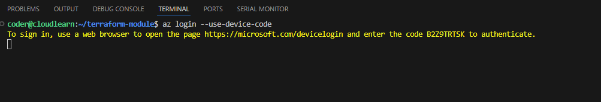

This guide will walk you through the process of authenticating your Visual Studio Code (VS Code) environment with your Azure account, which is a crucial first step before deploying infrastructure to Azure using Terraform.

Terraform interacts with Azure to create, modify, and destroy resources. To do this, it needs to authenticate with your Azure account to verify your identity and permissions. When you run Terraform commands (like `terraform plan` or `terraform apply`) in your terminal within VS Code, Terraform will automatically use the credentials established by the Azure CLI.

### Instructions

1.  Open Visual Studio Code and Integrated Terminal
You can do this in a few ways:

```
* Go to **Terminal > New Terminal** from the top menu.
* Use the keyboard shortcut:
    * Windows/Linux: `Ctrl + `` (backtick)
    * macOS: `Cmd + `` (backtick)
```

A terminal window will appear at the bottom of your VS Code interface.

2. Initiate Azure Login

In the VS Code integrated terminal, type the following command and press Enter:

```bash
az login
```


3. Complete Authentication in Your Browser

Upon executing `az login`, your default web browser will automatically open a new tab and redirect you to the Azure login page.

* **Follow the prompts:** Enter your Azure account credentials (email, password, MFA if configured).
* **Success Message:** Once authenticated, the browser tab will display a message indicating that you have successfully logged in and can close the window.

Back in your VS Code terminal, you will see a JSON output showing your subscription details, including your tenant ID, user information, and the default subscription you are logged into.


```json
{
  "cloudName": "AzureCloud",
  "homeTenantId": "xxxxxxxx-xxxx-xxxx-xxxx-xxxxxxxxxxxx",
  "id": "yyyyyyyy-yyyy-yyyy-yyyy-yyyyyyyyyyyy",
  "isDefault": true,
  "managedByTenants": [],
  "name": "My Azure Subscription",
  "state": "Enabled",
  "tenantId": "xxxxxxxx-xxxx-xxxx-xxxx-xxxxxxxxxxxx",
  "user": {
    "name": "your_email@example.com",
    "type": "User"
  }
}
```

4. Verify Your Azure Login (Optional but Recommended)

To confirm that you are correctly logged in and see which subscription is active, you can use the following command in the VS Code terminal:

```bash
az account show
```

This command will display the details of your currently active Azure subscription.

5. Terraform Will Now Use Your Azure Credentials

With the Azure CLI successfully authenticated in your terminal session, Terraform will automatically detect and use these credentials when you run any Terraform commands (e.g., `terraform init`, `terraform plan`, `terraform apply`, `terraform destroy`) within the same terminal or any new terminals opened in VS Code during the same session.


You are now ready to start deploying your Terraform configurations to Azure from within VS Code!