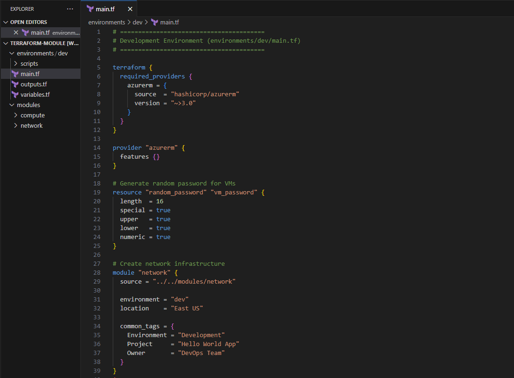
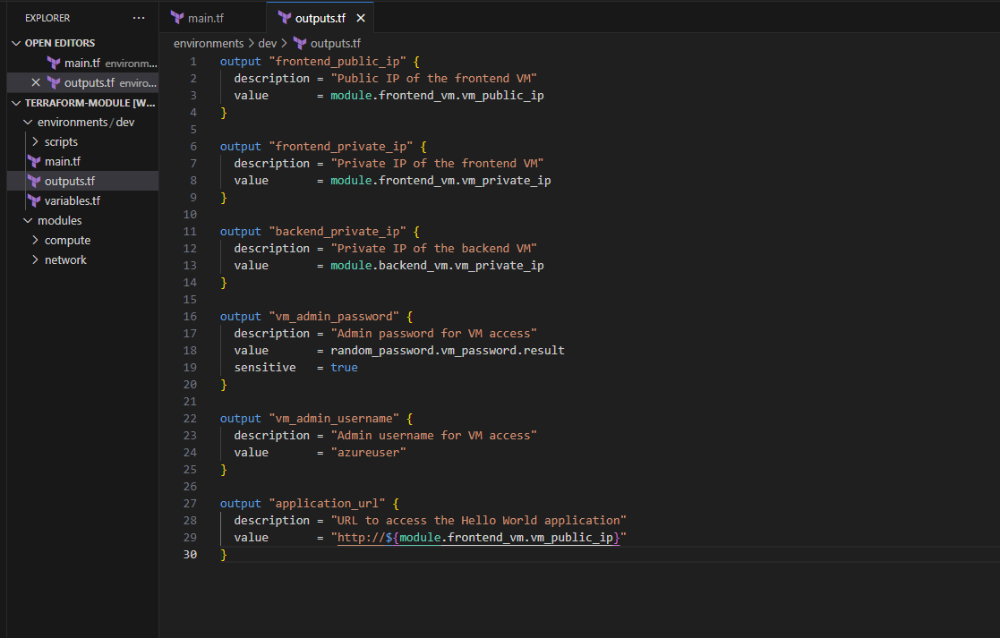
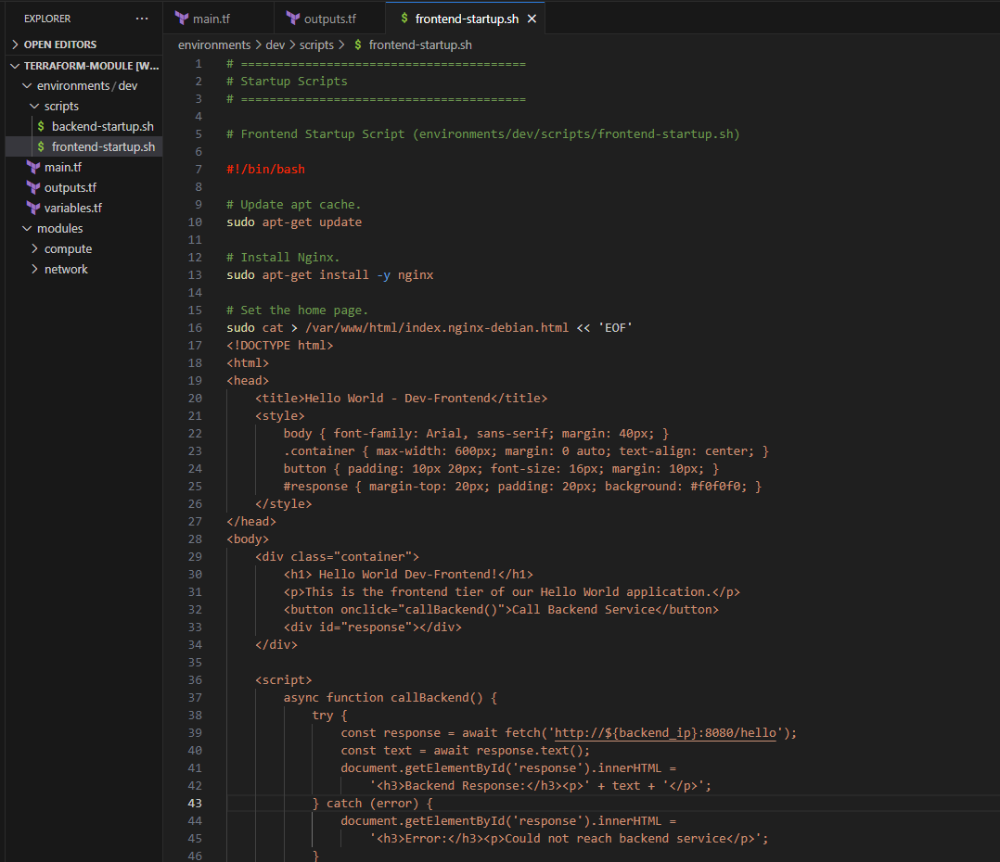
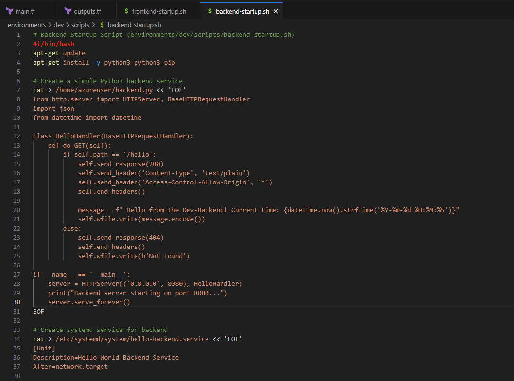
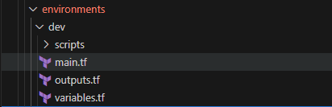
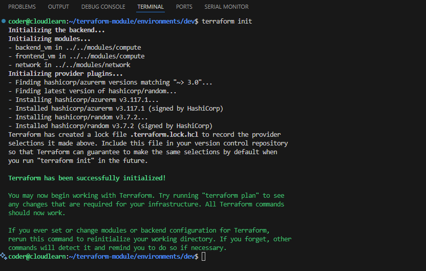
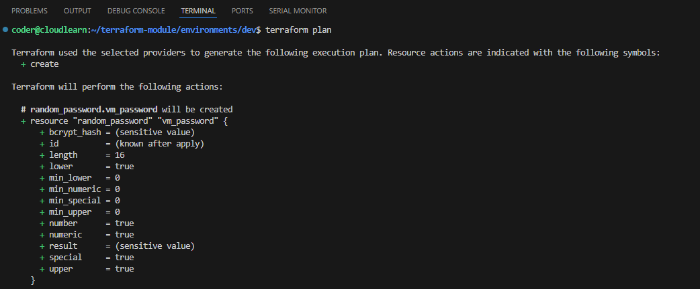
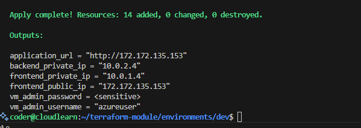

Now that we have our core Network and Compute modules (our robust "LEGO blocks" or "templates"), the process of deploying different environments becomes incredibly efficient.

Instead of rewriting infrastructure code for each environment, we simply need to:

1. Define the specific configurations and requirements for our Development (Dev) and Production (Prod) environments.
2. Feed these unique configurations as variables into our standardized Network and Compute modules.

---

**Planned Difference for the Prod and Dev Environment.**

| Feature / Configuration Aspect | Development Environment (Dev)                                     | Production Environment (Prod)                                            |
| :----------------------------- | :---------------------------------------------------------------- | :----------------------------------------------------------------------- |
| **Environment Identifier**     | `environment = "dev"`                                             | `environment = "prod"`                                                   |
| **VM Admin Password Source**   | Generated by `random_password` resource directly in `dev/main.tf` | Retrieved from Azure Key Vault using `data "azurerm_key_vault_secret"`   |
| **Frontend VM Size**           | `vm_size = "Standard_B1s"` (Smaller, cost-effective)              | `vm_size = "Standard_B2s"` (Larger, more performance)                    |
| **Backend VM Size**            | `vm_size = "Standard_B1s"` (Smaller, cost-effective)              | `vm_size = "Standard_B2s"` (Larger, more performance)                    |
| **VM Disk Type**               | Uses module default (`Premium_LRS`) - but it's the same default   | Explicitly set to `disk_type = "Premium_LRS"` (Ensures high performance) |
| **VNet Name Convention**       | `dev-hello-world-vnet`                                            | `prod-hello-world-vnet`                                                  |
| **Resource Group Name**        | `dev-hello-world-rg`                                              | `prod-hello-world-rg`                                                    |

### Instructions.

1. Let's create Module main configuration with required configuration drift.Open the `main.tf` file (terraform-module/environments/dev/main.tf) in VSCode and add the following code content:

    ``` bash
    # ========================================
    # Development Environment (environments/dev/main.tf)
    # ========================================

    terraform {
      required_providers {
        azurerm = {
          source  = "hashicorp/azurerm"
          version = "~>3.0"
        }
      }
    }

    provider "azurerm" {
      features {}
    }

    # Generate random password for VMs
    resource "random_password" "vm_password" {
      length  = 16
      special = true
      upper   = true
      lower   = true
      numeric = true
    }

    # Create network infrastructure
    module "network" {
      source = "../../modules/network"

      environment = "dev"
      location    = "East US"

      common_tags = {
        Environment = "Development"
        Project     = "Hello World App"
        Owner       = "DevOps Team"
      }
    }

    # Frontend VM with Hello World web server
    module "frontend_vm" {
      source = "../../modules/compute"

      vm_name             = "dev-frontend-vm"
      location            = module.network.resource_group_location
      resource_group_name = module.network.resource_group_name
      subnet_id           = module.network.frontend_subnet_id
      vm_size             = "Standard_B1s"  # Small size for dev
      admin_password      = random_password.vm_password.result
      create_public_ip    = true

      startup_script = templatefile("${path.module}/scripts/frontend-startup.sh", {
        backend_ip = module.backend_vm.vm_private_ip
      })

      common_tags = {
        Environment = "Development"
        Project     = "Hello World App"
        Tier        = "Frontend"
      }

      depends_on = [module.backend_vm]
    }

    # Backend VM with API service
    module "backend_vm" {
      source = "../../modules/compute"

      vm_name             = "dev-backend-vm"
      location            = module.network.resource_group_location
      resource_group_name = module.network.resource_group_name
      subnet_id           = module.network.backend_subnet_id
      vm_size             = "Standard_B1s"  # Small size for dev
      admin_password      = random_password.vm_password.result
      create_public_ip    = false  # Backend is private

      startup_script = file("${path.module}/scripts/backend-startup.sh")
      # Assuming backend-startup.sh sets up the API service

      common_tags = {
        Environment = "Development"
        Project     = "Hello World App"
        Tier        = "Backend"
      }
    }
    ```

    

    ``` bash
    module "network" {
    source = "../../modules/network"
    # ...other variables...  }
    ```

    This Terraform module block provisions a backend virtual machine (VM) using the "compute" and "network" modules.

    - `location`: Uses the location from the network module's resource group.

    - `resource_group_name`: Associates the VM with the resource group from the network module.

    - `subnet_id`: Places the VM in the backend subnet provided by the network module.
      


2. Open the `outputs.tf` terraform Configuration (/environments/dev/outputs.tf) file and add the following code:

    ``` bash
    output "frontend_public_ip" {
      description = "Public IP of the frontend VM"
      value       = module.frontend_vm.vm_public_ip
    }

    output "frontend_private_ip" {
      description = "Private IP of the frontend VM"
      value       = module.frontend_vm.vm_private_ip
    }

    output "backend_private_ip" {
      description = "Private IP of the backend VM"
      value       = module.backend_vm.vm_private_ip
    }

    output "vm_admin_password" {
      description = "Admin password for VM access"
      value       = random_password.vm_password.result
      sensitive   = true
    }

    output "vm_admin_username" {
      description = "Admin username for VM access"
      value       = "azureuser"
    }

    output "application_url" {
      description = "URL to access the Hello World application"
      value       = "http://${module.frontend_vm.vm_public_ip}"
    }

    ```

    

      The `outputs.tf` file is the designated place to expose critical access details for your deployed infrastructure, such as web URLs and SSH connection information. This makes it incredibly easy to retrieve these values after your infrastructure has been provisioned.


3. Open the `frontend-startup.sh` file (environments/dev/scripts/frontend-startup.sh) and add the following script:
    ```bash
    # ========================================
    # Startup Scripts
    # ========================================

    # Frontend Startup Script (environments/dev/scripts/frontend-startup.sh)

    #!/bin/bash

    # Update apt cache.
    sudo apt-get update

    # Install Nginx.
    sudo apt-get install -y nginx

    # Set the home page.
    sudo cat > /var/www/html/index.nginx-debian.html << 'EOF'
    <!DOCTYPE html>
    <html>
    <head>
        <title>Hello World - Dev-Frontend</title>
        <style>
            body { font-family: Arial, sans-serif; margin: 40px; }
            .container { max-width: 600px; margin: 0 auto; text-align: center; }
            button { padding: 10px 20px; font-size: 16px; margin: 10px; }
            #response { margin-top: 20px; padding: 20px; background: #f0f0f0; }
        </style>
    </head>
    <body>
        <div class="container">
            <h1> Hello World Dev-Frontend!</h1>
            <p>This is the frontend tier of our Hello World application.</p>
            <button onclick="callBackend()">Call Backend Service</button>
            <div id="response"></div>
        </div>

        <script>
            async function callBackend() {
                try {
                    const response = await fetch('http://${backend_ip}:8080/hello');
                    const text = await response.text();
                    document.getElementById('response').innerHTML =
                        '<h3>Backend Response:</h3><p>' + text + '</p>';
                } catch (error) {
                    document.getElementById('response').innerHTML =
                        '<h3>Error:</h3><p>Could not reach backend service</p>';
                }
            }

            // Auto-call backend on page load
            window.onload = callBackend;
        </script>
    </body>
    </html>
    EOF

    # Start nginx
    sudo systemctl start nginx
    sudo systemctl enable nginx

    ```
    

    This script turns a fresh Linux server into a web server that hosts a basic "Hello World" webpage. This webpage is specifically designed to be the frontend of an application, as it attempts to connect to a separate backend service (using an automatically filled-in IP address) to get more information, simulating a common two-tier application setup. It's a quick way to get a development frontend up and running with Nginx.

4. Open the `backend-startup.sh` file (environments/dev/scripts/backend-startup.sh) and add the following script:

    ```bash
    # Backend Startup Script (environments/dev/scripts/backend-startup.sh)
    #!/bin/bash
    apt-get update
    apt-get install -y python3 python3-pip

    # Create a simple Python backend service
    cat > /home/azureuser/backend.py << 'EOF'
    from http.server import HTTPServer, BaseHTTPRequestHandler
    import json
    from datetime import datetime

    class HelloHandler(BaseHTTPRequestHandler):
        def do_GET(self):
            if self.path == '/hello':
                self.send_response(200)
                self.send_header('Content-type', 'text/plain')
                self.send_header('Access-Control-Allow-Origin', '*')
                self.end_headers()

                message = f" Hello from the Dev-Backend! Current time: {datetime.now().strftime('%Y-%m-%d %H:%M:%S')}"
                self.wfile.write(message.encode())
            else:
                self.send_response(404)
                self.end_headers()
                self.wfile.write(b'Not Found')

    if __name__ == '__main__':
        server = HTTPServer(('0.0.0.0', 8080), HelloHandler)
        print("Backend server starting on port 8080...")
        server.serve_forever()
    EOF

    # Create systemd service for backend
    cat > /etc/systemd/system/hello-backend.service << 'EOF'
    [Unit]
    Description=Hello World Backend Service
    After=network.target

    [Service]
    Type=simple
    User=azureuser
    WorkingDirectory=/home/azureuser
    ExecStart=/usr/bin/python3 /home/azureuser/backend.py
    Restart=always

    [Install]
    WantedBy=multi-user.target
    EOF

    # Start the backend service
    systemctl daemon-reload
    systemctl start hello-backend
    systemctl enable hello-backend
    ```
    

      This script takes a basic server, installs Python, then creates a small Python program that acts like a receptionist. This receptionist waits for specific "hello" questions on port 8080 and replies with a "Hello from the Backend!" message plus the current time. Finally, it sets up the server so this receptionist program always runs automatically and restarts if anything goes wrong. This makes the server the backend that the frontend (from the previous script) can talk to.


 Once you complete all the 3 steps your current working directory should look like this.



If you take a close look at our `environments/dev/main.tf` file, you'll notice a powerful example of module reusability in action:

```terraform
# ...
module "frontend_vm" {
  source = "../../modules/compute"
  # ... specific frontend VM configuration ...
}

module "backend_vm" {
  source = "../../modules/compute"
  # ... specific backend VM configuration ...
}
# ...
```

**Here, our single `modules/compute` directory acts as a reusable template for creating a virtual machine. Even though we only defined the compute module once, we are instantiating it twice within the dev environment:**

1. Once for the frontend VM (`module "frontend_vm"`).
2. And again for the backend VM (`module "backend_vm"`).

This perfectly demonstrates how our modular "LEGO blocks" enable us to deploy multiple, specialized resources efficiently from a single, well-defined blueprint.

---
####  Congratulations!  Your Dev Environment Configuration is Ready!

Awesome work! You've successfully outlined the specific configurations for your Development environment. This means you've now defined the crucial "configuration drift" – the precise differences that make your Dev setup distinct from others, like Production.
**You've essentially given your Terraform "LEGO blocks" (the Network and Compute modules) all the instructions they need to build your Hello World Multi-Tier application specifically for development purposes.**

You're all set to deploy it! Let's deploy our Dev Environment with Terraform.


Before we start, let's briefly recap the fundamental Terraform commands you'll be using:

* **`terraform init`**: Initializes your working directory. This command is run once for a new (or cloned) Terraform configuration. It downloads necessary provider plugins (like AzureRM) and sets up the backend (where Terraform stores its state).
* **`terraform plan`**: Generates an execution plan. This command shows you what Terraform *will do* (create, modify, or destroy) to reach the desired state defined in your configuration files, without actually making any changes. **Always review your plan!**
* **`terraform apply`**: Executes the actions proposed in a `terraform plan`. This command provisions or updates your infrastructure in Azure. It will typically ask for confirmation before proceeding.
* **`terraform destroy`**: Destroys the infrastructure managed by the current Terraform configuration. This is crucial for labs to avoid incurring unnecessary costs. **Use with extreme caution in real environments!**

---

5.  **Navigate to the Dev Environment Directory:**
    Open your terminal or command prompt and change your directory to the `dev` environment folder within your project:

    ```bash
    cd terraform-module/environments/dev
    ```

6.  **Initialize Terraform:**
    This prepares the directory for use with Terraform.

    ```bash
    terraform init
    ```
    *Expected Output:* You should see messages indicating that the AzureRM and `random` providers have been initialized successfully.
    
    

7.  **Generate a Deployment Plan:**
    Review what Terraform intends to create in your Azure subscription. Pay close attention to the resources being added (`+`), modified (`~`), or destroyed (`-`).

    ```bash
    terraform plan
    ```
     
    *Expected Output:* Terraform will list all the Azure resources it plans to create (Resource Group, VNet, Subnets, NSGs, two Linux VMs, Public IP). It will show a summary like "Plan: X to add, 0 to change, 0 to destroy."

8.  **Apply the Deployment:**
    Execute the plan to provision the resources in Azure. You will be prompted to type `yes` to confirm.

    ```bash
    terraform apply
    ```
    
    *Expected Output:* Terraform will start provisioning resources. This can take several minutes. Once complete, it will display the outputs defined in `outputs.tf`, including the public IP for the frontend and the VM admin password.

9.  **Verify the Development Application:**

    * **Get Outputs:**
        You can always retrieve the outputs using:
        ```bash
        terraform output
        ```
        Look for `application_url` and `vm_admin_password`.
         

    * **Access the Frontend:**
        Copy the `application_url` (e.g., `http://X.X.X.X`) from the outputs and paste it into your web browser.
        You should see "Hello World Frontend!" and a "Call Backend Service" button. Clicking it should display "Hello from the Backend!"
        If you see "Could not reach backend service," it might be a temporary startup issue (wait a minute and refresh) or a network/script problem.

    * **Login to VM (Optional):**
        You can SSH into the frontend VM using the `frontend_public_ip` and `vm_admin_username` (`azureuser`) and `vm_admin_password` from the outputs.
        
        ```bash
        ssh azureuser@<YOUR_FRONTEND_PUBLIC_IP>
        ```
        (On Windows, you can use Git Bash or PuTTY.)

10.  **Clean Up the Development Environment:**
    **IMPORTANT:** To avoid ongoing Azure costs, always destroy resources after your lab work.

    ```bash
    terraform destroy
    ```
    *Expected Output:* Terraform will list all resources it plans to destroy. Type `yes` to confirm. This will remove all resources created for the Dev environment.

---


Important Tips for Terraform

* **Always Review `terraform plan`:** This is your safety net. Never apply a plan you haven't thoroughly reviewed.
* **Terraform State:** Terraform keeps track of your infrastructure in a "state file" (`terraform.tfstate`). This file maps your configuration to your actual cloud resources. **Do not modify this file manually.** For real-world projects, store this state remotely (e.g., in an Azure Storage Account) for team collaboration and resilience.
* **Error Handling:** If `terraform apply` fails, read the error messages carefully. They usually provide good clues. Common issues include typos, missing permissions, or resource name conflicts.
* **Idempotency:** Terraform is designed to be idempotent. This means you can run `terraform apply` multiple times on the same configuration, and it will only make changes if there's a drift from the desired state.
* **Cleanup is Key:** For lab environments, always, always, **always** remember to run `terraform destroy` when you are done.

---

### Congratulations! 🚀🎉

You've now successfully learned to deploy and manage different environments using Terraform's modular power!