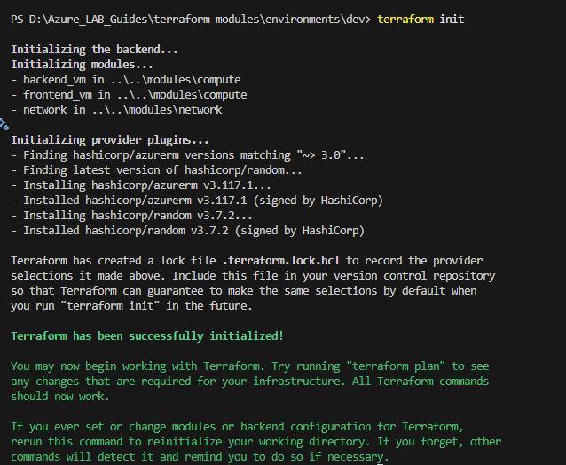

# 🚀5.0 Terraform Execution Guide for Multi-Tier Application Lab

This guide will walk you through the essential Terraform commands to deploy, verify, and clean up your Development (Dev).

## 🎯 5.1 The Core Terraform Workflow

Before we start, let's briefly recap the fundamental Terraform commands you'll be using:

* **`terraform init`**: Initializes your working directory. This command is run once for a new (or cloned) Terraform configuration. It downloads necessary provider plugins (like AzureRM) and sets up the backend (where Terraform stores its state).
* **`terraform plan`**: Generates an execution plan. This command shows you what Terraform *will do* (create, modify, or destroy) to reach the desired state defined in your configuration files, without actually making any changes. **Always review your plan!**
* **`terraform apply`**: Executes the actions proposed in a `terraform plan`. This command provisions or updates your infrastructure in Azure. It will typically ask for confirmation before proceeding.
* **`terraform destroy`**: Destroys the infrastructure managed by the current Terraform configuration. This is crucial for labs to avoid incurring unnecessary costs. **Use with extreme caution in real environments!**

---

## 🧪 5.2 Deploying the Development Environment

The Dev environment uses a randomly generated password for convenience and smaller VMs for cost efficiency.

1.  **Navigate to the Dev Environment Directory:**
    Open your terminal or command prompt and change your directory to the `dev` environment folder within your project:

    ```bash
    cd terraform-module/environments/dev
    ```

2.  **Initialize Terraform:**
    This prepares the directory for use with Terraform.

    ```bash
    terraform init
    ```
    *Expected Output:* You should see messages indicating that the AzureRM and `random` providers have been initialized successfully.
    
    

3.  **Generate a Deployment Plan:**
    Review what Terraform intends to create in your Azure subscription. Pay close attention to the resources being added (`+`), modified (`~`), or destroyed (`-`).

    ```bash
    terraform plan
    ```
    *Expected Output:* Terraform will list all the Azure resources it plans to create (Resource Group, VNet, Subnets, NSGs, two Linux VMs, Public IP). It will show a summary like "Plan: X to add, 0 to change, 0 to destroy."

4.  **Apply the Deployment:**
    Execute the plan to provision the resources in Azure. You will be prompted to type `yes` to confirm.

    ```bash
    terraform apply
    ```
    *Expected Output:* Terraform will start provisioning resources. This can take several minutes. Once complete, it will display the outputs defined in `outputs.tf`, including the public IP for the frontend and the VM admin password.

5.  **Verify the Development Application:**

    * **Get Outputs:**
        You can always retrieve the outputs using:
        ```bash
        terraform output
        ```
        Look for `application_url` and `vm_admin_password`.

    * **Access the Frontend:**
        Copy the `application_url` (e.g., `http://X.X.X.X`) from the outputs and paste it into your web browser.
        You should see "Hello World Frontend!" and a "Call Backend Service" button. Clicking it should display "Hello from the Backend!"
        If you see "Could not reach backend service," it might be a temporary startup issue (wait a minute and refresh) or a network/script problem.

    * **Login to VM (Optional):**
        You can SSH into the frontend VM using the `frontend_public_ip` and `vm_admin_username` (`azureuser`) and `vm_admin_password` from the outputs.
        ```bash
        ssh azureuser@<YOUR_FRONTEND_PUBLIC_IP>
        ```
        (On Windows, you can use Git Bash or PuTTY.)

6.  **Clean Up the Development Environment:**
    **IMPORTANT:** To avoid ongoing Azure costs, always destroy resources after your lab work.

    ```bash
    terraform destroy
    ```
    *Expected Output:* Terraform will list all resources it plans to destroy. Type `yes` to confirm. This will remove all resources created for the Dev environment.

---


## 💡5.3 Important Tips for Terraform

* **Always Review `terraform plan`:** This is your safety net. Never apply a plan you haven't thoroughly reviewed.
* **Terraform State:** Terraform keeps track of your infrastructure in a "state file" (`terraform.tfstate`). This file maps your configuration to your actual cloud resources. **Do not modify this file manually.** For real-world projects, store this state remotely (e.g., in an Azure Storage Account) for team collaboration and resilience.
* **Error Handling:** If `terraform apply` fails, read the error messages carefully. They usually provide good clues. Common issues include typos, missing permissions, or resource name conflicts.
* **Idempotency:** Terraform is designed to be idempotent. This means you can run `terraform apply` multiple times on the same configuration, and it will only make changes if there's a drift from the desired state.
* **Cleanup is Key:** For lab environments, always, always, **always** remember to run `terraform destroy` when you are done.

---

### Congratulations! 🚀🎉

You've now successfully learned to deploy and manage different environments using Terraform's modular power!